# Fast math library

Library with support for summation, transcedental and statistical functions, where some of them are accelerated (see table with supported functions below), wrapped SIMD instructions into templated interface and vector type with vectorized operations with SIMD instructions.

## Supported math functions

| Summation | Acceleration | Transcedental | Acceleration | Statistical | Acceleration |
|-----------|--------------|---------------|--------------|-------------|--------------|
| Sum        | SIMD Accelerated | Sin | Approximation + SIMD Accelerated | Min | SIMD Accelerated |
| Prefix sum (Inclusive scan) | SIMD Accelerated | Cos | Approximation + SIMD Accelerated | Max | SIMD Accelerated |
| | | Tan | None | Mode (int[]) | None |
| | | Cot | None | Median (int[]) | None |
| | | Sqrt | Approximation + SIMD Accelerated | Median (float[]) | None |
| | | InvSqrt | Approsimation + SIMD Accelerated | Arithmetic mean | SIMD Accelerated |
| | | | | Geometric mean | SIMD Accelerated |
| | | | | Weighted mean | SIMD Accelerated |
| | | | | Variance | SIMD Accelerated |
| | | | | Variance with specifiable probabilities | SIMD Accelerated |
| | | | | Sample variance | SIMD Accelerated |
| | | | | Standard deviation | SIMD Accelerated |
| | | | | Standard deviation with specifiable probabilities | SIMD Accelerated |
| | | | | Sample standard deviation | SIMD Accelerated |

## Supported vector data type operations

- Operator +
- Operator -
- Operator *
- Operator /
- Absolute value
- Minimum
- Maximum
- Square root (only floating point vector)
- Approximated square root (only floating point vector)
- Inverse square root (only floating point vector)
- Approximated inverse square root (only floating point vector)
- Sine (only floating point vector)
- Cosine (only floating point vector)
- Tangent (only floating point vector)
- Cotangent (only floating point vector)
- Approximated sine (only floating point vector)
- Approximated cosine (only floating point vector)
- Cross product (only for 3 dimensional vector)
- Dot product
- Length (only floating point vector)
- Normalize (only floating point vector)
- xy - Creates 2 dimensional vector (only for 3 and 4 dimensional vector)
- xyz - Creates 3 dimensional vector (only for 4 dimensional vector)

## SIMD support

| Type of unit | Support |
|--------------|---------|
| SSE          | Not yet |
| AVX          | Yes |
| AVX-512      | Not yet |

## Wrapped Intel SIMD intrinsics

- some AVX float intrinsics
- some AVX2 int intrinsics

For more details see API.

## Project health

| Service | Status |
|---------|--------|
| [GitHub Actions](https://github.com/VMikulasek/fast_math_library/actions) | [](https://github.com/VMikulasek/fast_math_library/actions/workflows/math_lib_actions.yml) |

## Library usage

There are three ways to use this library:
- using CMake with FetchContent,
- using CMake as subdirectory,
- installation into system headers (not recommended)

### Using CMake with FetchContent

Add into CMakeLists.txt:

```cmake
include(FetchContent)
FetchContent_Declare(
    fast_math_library
    GIT_REPOSITORY https://github.com/VMikulasek/fast_math_library.git
    GIT_TAG 5da0d6c7f3c863e41bc697f3f3314d950e0e157e # put the highest version commit hash here
)
FetchContent_MakeAvailable(fast_math_library)
target_link_libraries(main PRIVATE math_lib)
```

### Using CMake as subirectory

Clone or download a copy of repository, place it on directory level of CMakeLists.txt, where the dependency should be registered and add following into the CMakeLists.txt:
```cmake
add_subdirectory(fast_math_library)
target_link_libraries(main PRIVATE math_lib)
```

### Installation into system headers

Clone or download copy of repository, run native CLI as superuser/administrator, navigate into fast_math_library root directory and run following commands:

```
mkdir build
cd build
cmake .. -DBUILD_TESTS=OFF -DBUILD_BENCHMARKS=OFF
cmake --build . --target install
```

This usage of library is not recommended due to definitions of macros, that are defined in build systems by CMake. These macros affect compilation based on whether machine contains specific SIMD units. In case of using this option, macros have to be defined explicitly.

## Tests and benchmarks

This library also provides tests and benchmarks implemented using [Google test](https://github.com/google/googletest) and [Google benchmark](https://github.com/google/benchmark).

By default both tests and benchmarks CMake options are turned:

- ON when CMake is run on fast_math_library as main project or
- OFF when CMake is run on fast_math_library as subdirectory

and can be influenced by setting CMake options BUILD_TESTS and BUILD_BENCHMARKS.

When these options are set to ON, build targets will be generated.

### Building and running tests

Ubuntu:
```
cd build/analysis/tests
make
ctest
```
Windows:
Open solution in Visual Studio, build `math_lib_tests` target and run produced binary.

### Building and running benchmarks

Ubuntu:
```
cd build/analysis/benchmarks
make
sudo cpupower frequency-set --governor performance > /dev/null 2>&1
./{benchmark binaries}
...
sudo cpupower frequency-set --governor powersave > /dev/null 2>&1
```

Windows:
Open solution in Visual Studio, build targets `seq_math_lib_benchmarks`, `avx_math_lib_benchmarks`,... and run produced binaries.

### Comparing benchmarks

[Google benchmark](https://github.com/google/benchmark) also provides a tool for benchmarks comparison, that can be applied here. For more informations see [Google benchmark tooling documentation](https://github.com/google/benchmark/blob/main/docs/tools.md).

### Benchmarks example results

Example machine specifications:
- CPU: 12th Gen Intel® Core™ i5-1240P × 16
- Memory: DDR4 SDRAM 16GB 3200 MT/s
- Compiler: GCC (optimizations O3)

Note: seq and avx marked results are this library

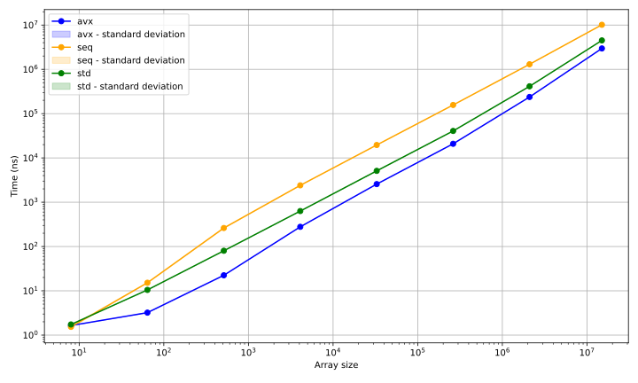

Note: std::execution::par used

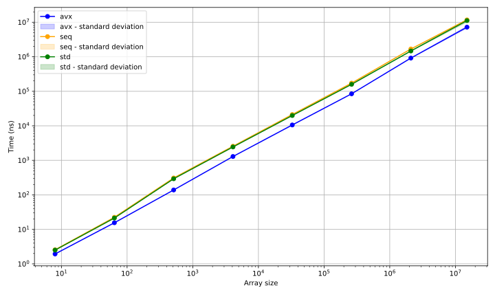

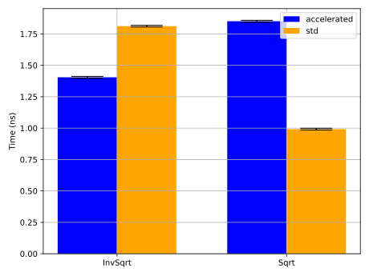

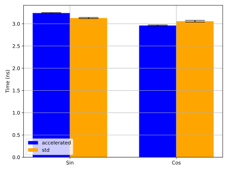


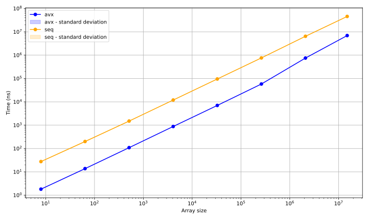


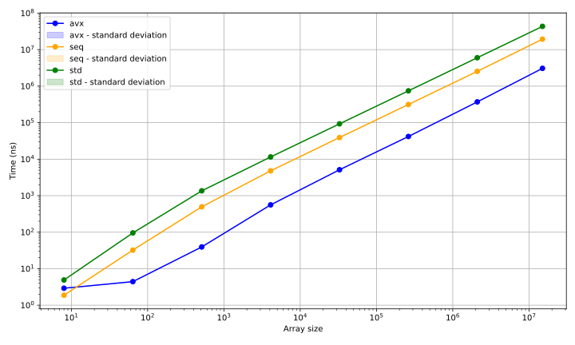

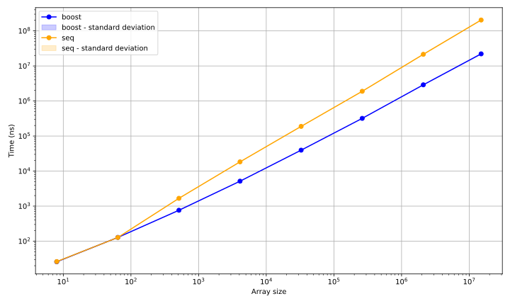
Note: boost variant uses in-place sort

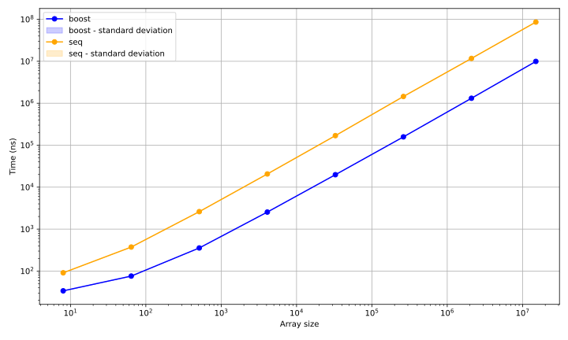
Note: boost variant uses in-place sort


Note: std::execution::par used in boost variant


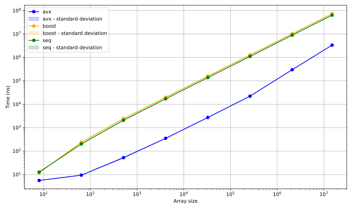


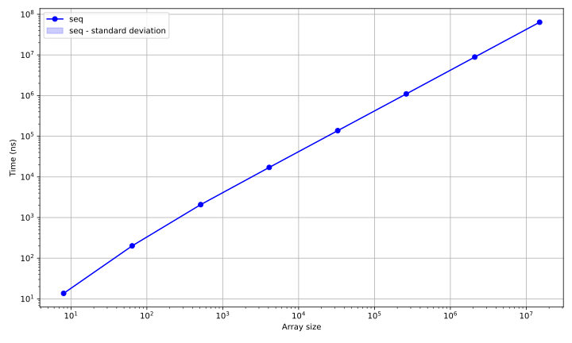

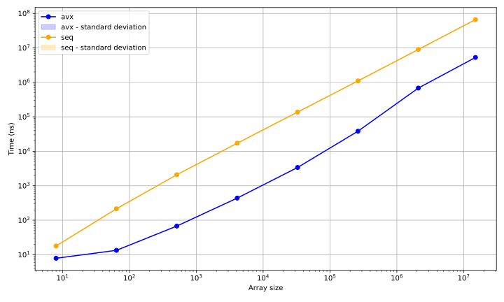


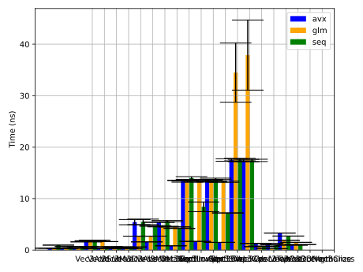

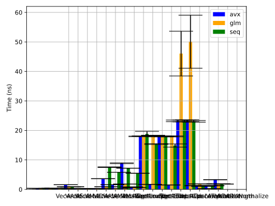
Note:
* 4-element vector is the only vectorized variant in GLM
* seq variant of 4-element vector is vectorized by compiler for simple operations